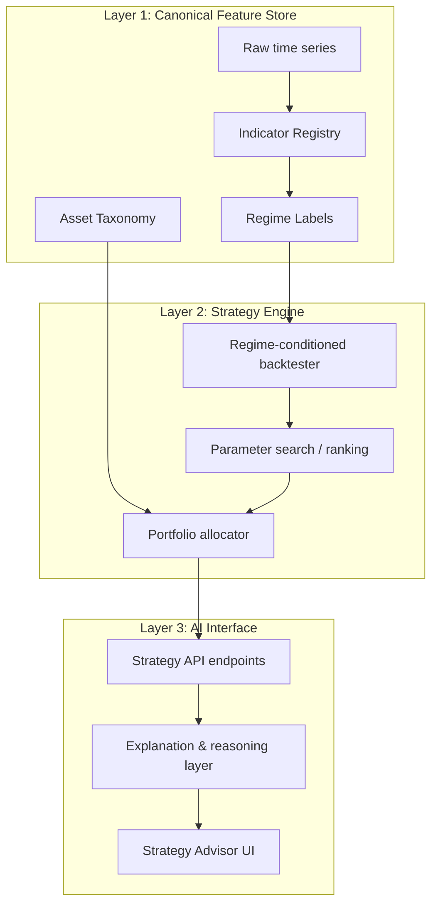

# AI Strategy Service — Design Document

## Goal

Build an AI-powered strategy service in Cryptological that can analyze the full breadth of market data, indicators, and regime context — the same signal users see across charts — and recommend investment strategies grounded in how assets and markets have historically behaved under comparable conditions.

The service must account for as many variables as practical: time of year, business-cycle phase, the four-year Bitcoin cycle, global monetary conditions, geopolitical events, asset risk-tier classification, and flight-to-safety dynamics. Recommendations should be explainable, backtestable, and honest about uncertainty — not a single opaque "optimum" answer.

Because much of the data arrives raw from the backend while the frontend derives many informative indicators and composites, the service must be designed so the AI sees the same computed features users rely on in charts, not only the raw API payloads.

---

## Current State (Baseline)

| Layer | What exists today |
|-------|-------------------|
| **Backend** | Raw prices, on-chain metrics, precomputed risk metrics, Tx-MVRV ratio, FRED macro, altcoin season, dominance |
| **Frontend** | Bitcoin Risk Metric, Pi Cycle, Market Heat Index, Puell, Mayer, Sahm, Workbench derived series, DCA backtests |
| **Strategy tooling** | Dynamic DCA Simulator (risk-based and tx-tension strategies with tiered buy/sell rules) |
| **ML / AI** | None — all analytics are rule-based and deterministic |

**Core gap:** Indicator logic is split between backend precomputation and frontend derivation. An AI service reading only backend endpoints would miss roughly half the signal users actually use.

---

## Architecture Overview

Three layers, built in order:

```
Layer 1: Canonical Feature Store   →  one source of truth for all indicators & regime labels
Layer 2: Strategy Engine           →  backtesting, ranking, allocation
Layer 3: AI Interface              →  API + LLM explanation layer + Strategy Advisor UI
```



---

## Suggested Processes

### Process 1: Canonical Feature Store

**Objective:** Consolidate all chart-relevant computations into a server-side store so the AI and the frontend read identical data.

**Steps:**

1. Create an **Indicator Registry** — a catalog where each indicator has:
   - Definition (formula, parameters, lookback windows)
   - Input series (which raw data it depends on)
   - Output (daily time series stored in Postgres)
   - Version hash (so logic changes are traceable)

2. Port high-value frontend computations to backend precompute commands (following the existing pattern used for `tx_mvrv_ratio.py` and `precompute_risk_metrics.py`):
   - Bitcoin Risk Metric (`utility/riskMetric.js`)
   - Market Heat Index composite (default weights + user-weight profiles)
   - Pi Cycle, Mayer Multiple, Puell Multiple, Sahm Rule
   - Monthly seasonality buckets
   - Cycle phase labels (days from halving / bottom / peak)

3. Add a nightly `precompute_indicators.py` step to the existing pipeline (`update_all.py` → precompute → Postgres).

4. Update the frontend to consume precomputed series where available, eliminating duplication over time.

**Solving the frontend visibility problem (preferred order):**

| Option | Approach | Notes |
|--------|----------|-------|
| **A (recommended)** | Server-side indicator parity | Port logic to Python; one source of truth |
| **B** | Shared declarative spec | YAML/JSON recipes interpreted by both FE and BE |
| **C** | Frontend feature export | FE POSTs computed snapshots to AI service — quick prototype, fragile long-term |

---

### Process 2: Regime Labeling

**Objective:** Formalize the contextual dimensions charts already imply into daily regime labels stored alongside indicators.

**Regime dimensions to add:**

| Regime | Existing signals | Labels to create |
|--------|------------------|------------------|
| **4-year cycle** | Halving dates, cycle days left | `pre_halving`, `post_halving_rally`, `late_cycle`, `bear_market` |
| **Business cycle** | Sahm Rule, USRECD, T10Y2Y, UNRATE, initial claims | `expansion`, `late_cycle`, `recession`, `recovery` |
| **Monetary conditions** | Fed funds, M2 growth, Fed balance sheet | `tightening`, `neutral`, `easing`, `QE` |
| **Seasonality** | Monthly returns table | `month_of_year` (1–12), `Q4_rally_window` |
| **Risk appetite** | VIX, Fear & Greed, dominance shifts | `risk_on`, `risk_off`, `flight_to_safety` |
| **Crypto-specific** | Altcoin season index, dominance | `btc_dominance_rising`, `alt_season`, `stablecoin_inflow` |
| **Geopolitical** | Not yet in the system | Curated event calendar or proxy via VIX spikes + gold/BTC correlation; start as event overlay, not continuous feature |

**Deliverable:** A `RegimeSnapshot` model — one daily row containing all regime labels plus key indicator values at their historical percentile rank.

---

### Process 3: Asset Taxonomy

**Objective:** Classify every tracked asset so the strategy engine can reason about risk curve position and historical behavior by regime.

**Example risk tiers:**

| Tier | Classification | Examples |
|------|----------------|----------|
| 0 | Flight-to-safety | BTC, stablecoins, gold proxy |
| 1 | Large-cap crypto | ETH, SOL, BNB |
| 2 | Mid-cap alts | LINK, AVAX, DOT, ADA |
| 3 | High-beta alts | Memecoins, small caps |
| 4 | Crypto-adjacent equities | MSTR, COIN, miners |
| 5 | Broad equities | SP500, NVDA, etc. |

**Per-asset metadata to store:**

- `beta_to_btc`
- `correlation_to_sp500_in_risk_off`
- `avg_drawdown_in_bear`
- `historical_outperformance_by_regime` (computed from backtests)

---

### Process 4: Strategy Engine

**Objective:** Find and rank strategies under user-defined constraints. Extend the existing Dynamic DCA Simulator pattern server-side.

**"Optimum" must always be defined relative to:** risk tolerance, time horizon, asset universe, and historical sample. Never present a single answer without exposing trade-offs.

#### Stage A — Regime-conditioned rule optimization (months 1–3)

1. Define a strategy as: `(signal, buy_tiers[], sell_tiers[], asset_weights[], rebalance_frequency)`.
2. For each historical regime segment, backtest all candidate strategies.
3. Rank by risk-adjusted return, max drawdown, Sharpe ratio, recovery time.
4. Output ranked strategies with full backtest statistics per regime.

*No neural networks required. Fully explainable. Builds directly on Dynamic DCA Simulator logic.*

#### Stage B — Pattern matching / similarity search (months 3–6)

1. Embed current market state as a feature vector: `[risk_metric, mvrv_z, heat_index, cycle_phase, sahm_signal, vix_percentile, dominance_btc, alt_season_index, month_of_year, ...]`.
2. Find the K most similar historical windows (cosine distance or learned embedding).
3. Report what followed in those analogue periods (90 / 180 / 365-day asset performance).

*Shows what happened in comparable conditions — not a prediction.*

#### Stage C — ML allocation model (months 6+, only if A and B prove value)

1. Train a regime-aware allocator (gradient boosting or simple neural net) on the feature store.
2. Target: next-period relative returns across asset tiers.
3. Mandatory walk-forward validation; never train on future data.
4. Always show confidence intervals and regime breakdown.

---

### Process 5: AI Interface

**Objective:** Present strategy recommendations through an explainable, conversational layer. The LLM narrates; the strategy engine computes.

**Pipeline:**

```
User question
  → Feature store produces current regime vector
  → Strategy engine returns top-ranked strategies + backtest stats
  → Similarity search returns closest historical analogues
  → LLM synthesizes findings in plain English, citing specific indicators
```

**Example response shape:**

> Current regime: late-cycle (day 847 post-halving), expansion but Sahm rising, monetary neutral-tightening, risk metric 0.72.
>
> Strategy ranking (2016–2025 backtest):
> 1. Reduced DCA + 20% trim above 0.65 risk → 18.2% CAGR, −34% max DD
> 2. …
>
> Closest historical analogue: Oct 2021 (similarity 0.89) → BTC fell 47% over next 6 months; dominance rose 12pp.
>
> Suggested allocation: 60% BTC, 15% ETH, 10% stables, 15% cash
> Confidence: moderate

**Do not** let the LLM pick trades directly from raw data — it will hallucinate patterns and cannot backtest.

**Deliverables:**

- `/api/strategy/analyze/` — accepts user constraints (risk tolerance, horizon, assets); returns ranked strategies + analogues
- Strategy Advisor UI (premium) — chat panel, allocation chart, "why this" breakdown citing existing chart names
- Support both "default model" and "user-configured weights" (e.g. Market Heat Index slider settings)

---

## Implementation Sequence

| Step | Task | Depends on |
|------|------|------------|
| 1 | Indicator Registry doc + Python ports (Bitcoin Risk Metric, Market Heat Index first) | — |
| 2 | `RegimeSnapshot` model + daily labeling job | Step 1 |
| 3 | Asset taxonomy metadata | — |
| 4 | `StrategyBacktest` service (server-side Dynamic DCA + multi-asset) | Steps 1–3 |
| 5 | `/api/strategy/analyze/` endpoint | Step 4 |
| 6 | Strategy Advisor UI | Step 5 |
| 7 | Similarity search (Stage B) | Steps 1–4 |
| 8 | ML allocator (Stage C) | Steps 1–7, only if prior stages validate |

---

## Design Constraints

- **"Optimum" does not exist in the abstract** — only optimum for a stated risk preference, horizon, and sample. Always expose the trade-off surface.
- **Overfitting is the primary risk** — with 60+ indicators and ~15 years of crypto data, unconstrained ML will find spurious patterns. Regime conditioning and walk-forward validation are mandatory.
- **Geopolitical data is sparse** — treat as event annotations until a reliable feed exists.
- **UK Nomis data bypasses the backend** — proxy through Django or exclude from AI scope initially.
- **User-specific weights** (Market Heat Index sliders) require both default-model and user-configured analyses.

---

## Mapping to Existing Features

| Existing feature | Role in AI service |
|------------------|-------------------|
| Market Heat Index | Composite feature in the registry |
| Dynamic DCA Simulator | Core of the strategy engine |
| Market Cycles / Cycle Days Left | 4-year cycle regime labels |
| On-chain risk metrics + Sahm + FRED | Business cycle and monetary regime labels |
| Dominance + altcoin season | Crypto market structure classification |
| Workbench | Future path for user-defined custom features |

The gap is not intelligence — it is **consolidation**. Once every indicator and regime label lives in one canonical store, the AI layer becomes a query and explanation engine on top of data the platform already trusts.